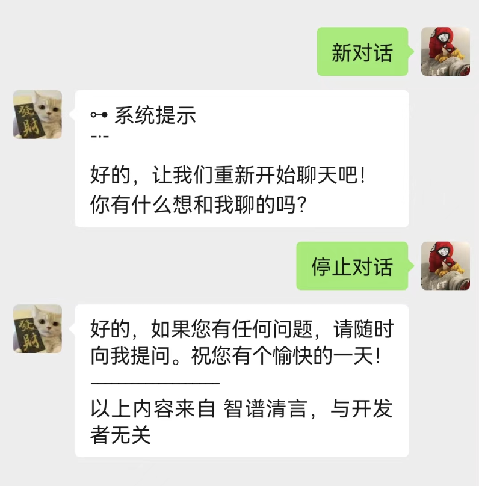
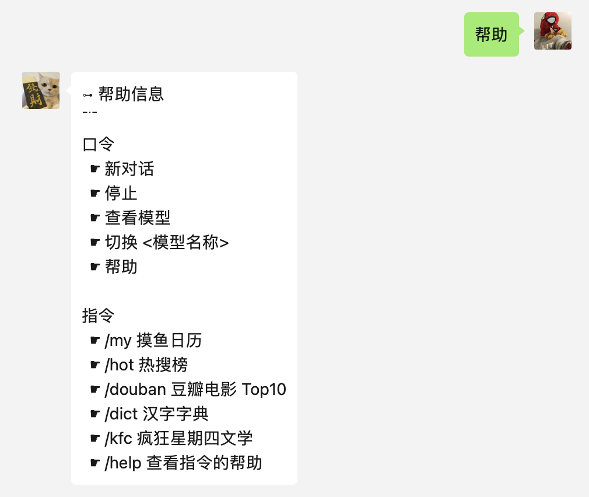
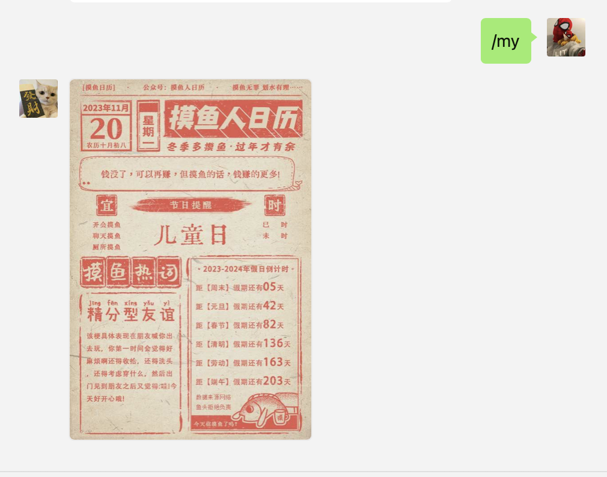
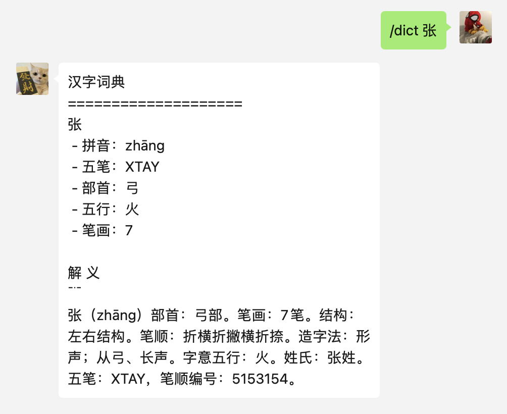
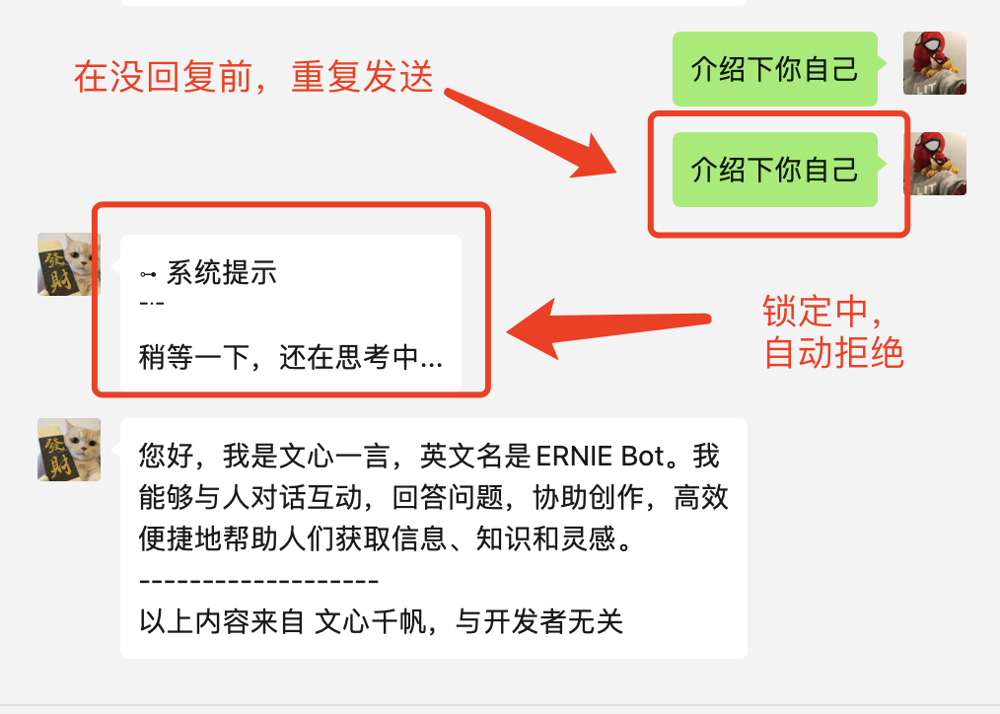

# 一、概念

使用本项目，你必须理解的概念。

## Keywords 口令

内置功能调用。模拟 web 界面操作，如：新建对话，停止回复。

口令，也就是关键词触发，可以说是不得以的办法的办法，这解决的时候，用户无法直接控制助手的行为。

我在研究钉钉的交互卡片，就是为了让用户可以通过交互式卡片控制 AI 的行为，以丰富界面交互的功能。

## Command 指令

二次开发实现的，以 `/` 斜线开始的自定义命令。主要用于增强机器人交互，执行不需要对话请求的功能调用，并且提供类似 CLI 参数解析的功能。

## Lock 请求锁

因为大模型和人不一样，无法持续接收以及实时交互，主要用于模拟 Web Loading 效果，限制限制用户消息频率，保护大模型不崩溃。

## LLM 大模型

大模型的目的是调用接收并处理微信消息，并调用大模型提供的 API，然后回复用户。

所以大模型相当于是 助手 和 API 之间的桥梁，让助手可以获得模型回复的能力。
