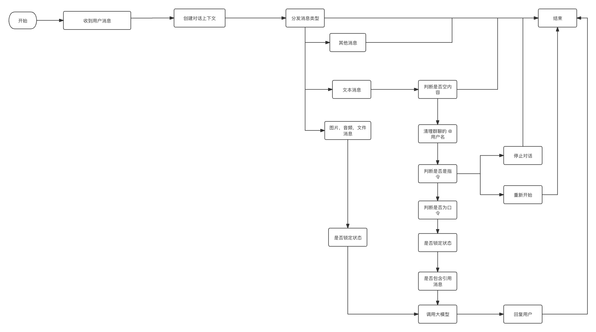

# 二、消息流程处理

以下是你需要了解的助手内部流程，方便你基于此项目开发属于自己的私人助手。

在阅读本章内容前，确保你理解我为这个项目造的 **概念**，你可以阅读 [概念](./concepts.md) 章节了解具体含义

## 消息处理以及模型调用

### 文本处理

> 计划是通过派发 `hook:onRoomMentionSelfTextMessage` 和 `hook:onIndividualTextMessage` 解决 `请求锁` 与 `切换模型` 的优先级，

**文本内容处理优先级**

1. 判断是否空内容
2. 清理提及的用户文本
3. 判断是否口令
4. 判断是否指令
5. 判断是否锁定状态
6. 判断是否包含引用消息文本

因为群聊被提及收到的内容是 `@阿德 /dict 张`，所以需要先清理提及的文本，这样后面的指令和口令才能正确判断。

**口令** 和 **指令** 顺序可以交换，因为这两个的优先级抖比较高，而且不会冲突。

**功能调用优先级**

1. 命令调用
2. 口令(部分)调用
3. 请求锁
4. 切换/查看模型（此口令由 [MultiChatModelSwitch](../src/llms/multi.ts) 提供）
5. 调用 AI 大模型

因为 **口令** 可以解除 **请求锁**，而 **命令** 不需要上下文，所以在请求锁之前。
